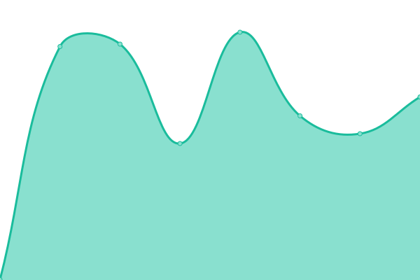

# [📈 Live Status](https://demo.upptime.js.org): <!--live status--> **🟩 All systems operational**

This repository contains the open-source uptime monitor and status page for [Ed Tee](http://propertywebbuilder.com), powered by [Upptime](https://github.com/upptime/upptime).

With [Upptime](https://upptime.js.org), you can get your own unlimited and free uptime monitor and status page, powered entirely by a GitHub repository. We use [Issues](https://github.com/etewiah/uptime-h2c/issues) as incident reports, [Actions](https://github.com/etewiah/uptime-h2c/actions) as uptime monitors, and [Pages](https://demo.upptime.js.org) for the status page.

<!--start: status pages-->
<!-- This summary is generated by Upptime (https://github.com/upptime/upptime) -->
<!-- Do not edit this manually, your changes will be overwritten -->
<!-- prettier-ignore -->
| URL | Status | History | Response Time | Uptime |
| --- | ------ | ------- | ------------- | ------ |
|  [New hhh](https://new.househunthero.com/) | 🟩 Up | [new-hhh.yml](https://github.com/etewiah/uptime-h2c/commits/HEAD/history/new-hhh.yml) | 

 496ms
     
 | 

<a href="https://etewiah.github.io/uptime-h2c/history/new-hhh">100.00%</a>
    

|  [Regular hhh](https://househunthero.com/) | 🟩 Up | [regular-hhh.yml](https://github.com/etewiah/uptime-h2c/commits/HEAD/history/regular-hhh.yml) | 

 483ms
     
 | 

<a href="https://etewiah.github.io/uptime-h2c/history/regular-hhh">100.00%</a>
    

|  [Hacker News](https://propertysquares.com) | 🟩 Up | [hacker-news.yml](https://github.com/etewiah/uptime-h2c/commits/HEAD/history/hacker-news.yml) | 

 477ms
     
 | 

<a href="https://etewiah.github.io/uptime-h2c/history/hacker-news">100.00%</a>
    

|  [h2c](https://homestocompare.com/) | 🟩 Up | [h2c.yml](https://github.com/etewiah/uptime-h2c/commits/HEAD/history/h2c.yml) | 

 506ms
     
 | 

<a href="https://etewiah.github.io/uptime-h2c/history/h2c">100.00%</a>
    

|  [pwb](https://propertywebbuilder.com/) | 🟩 Up | [pwb.yml](https://github.com/etewiah/uptime-h2c/commits/HEAD/history/pwb.yml) | 

 535ms
     
 | 

<a href="https://etewiah.github.io/uptime-h2c/history/pwb">100.00%</a>
    

|  [bvh](https://www.buenavistahomes.eu/en/) | 🟩 Up | [bvh.yml](https://github.com/etewiah/uptime-h2c/commits/HEAD/history/bvh.yml) | 

 1024ms
     
 | 

<a href="https://etewiah.github.io/uptime-h2c/history/bvh">100.00%</a>
    

<!--end: status pages-->

[**Visit our status website →**](https://demo.upptime.js.org)

## 📄 License

- Powered by: [Upptime](https://github.com/upptime/upptime)
- Code: [MIT](./LICENSE) © [Ed Tee](http://propertywebbuilder.com)
- Data in the `./history` directory: [Open Database License](https://opendatacommons.org/licenses/odbl/1-0/)
